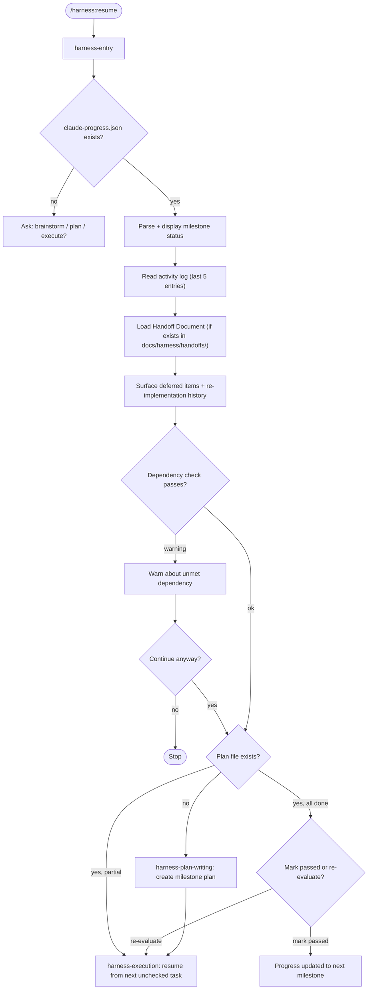
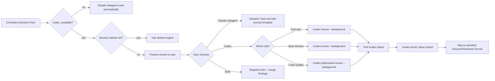

# super-harness v3.0.0

> **Built on [obra/superpowers](https://github.com/obra/superpowers)** — the agentic skills framework and software development methodology by Jesse Vincent. This project extends superpowers with cross-session milestone tracking, mandatory activity logging, an Orchestra / Executor / Reviewer agent architecture, and dual-engine Codex integration. If you haven't seen superpowers, start there first.

A Claude Code skill plugin for structured, long-running software development projects. Built on an **Orchestra / Executor / Reviewer** architecture that enforces strict separation between code writers and code reviewers, with optional Codex as an alternative engine for any role.

**Mac / Claude Code only.**

---

## Table of Contents

- [What This Plugin Does](#what-this-plugin-does)
- [Installation](#installation)
- [Commands](#commands)
- [Execute session checklist](#execute-session-checklist)
- [Architecture](#architecture)
- [Workflow Diagrams](#workflow-diagrams)
- [How to Use](#how-to-use)
- [Skills Reference](#skills-reference)
- [Codex Integration](#codex-integration)
- [File Structure](#file-structure)
- [Relationship to superpowers](#relationship-to-superpowers)

---

## What This Plugin Does

| Feature                             | Description                                                                                                                                                                          |
| ----------------------------------- | ------------------------------------------------------------------------------------------------------------------------------------------------------------------------------------ |
| **Orchestra / Executor / Reviewer** | Every task: Executor (TDD) → **TDD Audit** (process compliance) → Spec Reviewer (compliance) → Code Quality Reviewer (adversarial). Only Code Quality Review PASS completes a task. |
| **Dual-engine roles**               | Each role can use Claude subagent or Codex (`/codex:rescue`, `/codex:review`, `/codex:adversarial-review`). Engine choice is explicitly confirmed with the user at every task stage. |
| **Unified command routing**         | All `/harness:` commands route through `harness-entry` for consistent cross-cutting concern initialization.                                                                          |
| **Live Todo progress**              | During execution, Orchestra maintains a live TodoWrite list (task + sub-step level: Executor → TDD Audit → Spec Review → Code Quality Review → Logging).                                |
| **Cross-session progress**          | `status/claude-progress.json` tracks milestones across sessions. Step-level tracking via `current_task` field + human-readable `status/PROGRESS.md`.                                  |
| **Activity logging**                | Every completed task logged to `logs/activity-YYYY-MM-DD.jsonl` — engine used, Codex session IDs, review verdicts, deferred items, PROCESS_VIOLATION events.                           |
| **Visual Companion**                | Optional browser UI during brainstorming for mockups, architecture diagrams, and design option cards.                                                                                |
| **TDD Process Enforcement**         | Mandatory TDD Audit gate, Rationalization Counter-Tables, Red Flags STOP rules, Regression Test Validation Pattern, PROCESS_VIOLATION status for TDD violations.                        |
| **Session Handoffs**                | `harness:initialize` creates Handoff Documents (`docs/harness/handoffs/`). `/harness:resume` loads them. Context resets on milestone completion or after 5 consecutive tasks.        |

---

## Installation

### 1. Install via marketplace

Inside a Claude Code session:

```
/plugin marketplace add kuicao55/claude-plugins
/plugin install super-harness@kuicao-plugins
/reload-plugins
```

### 2. Install via plugin-dir (no marketplace)

```bash
git clone https://github.com/kuicao55/super-harness.git
claude --plugin-dir ./super-harness
```

### 3. (Optional) Enable Codex engine

```
/plugin marketplace add openai/codex-plugin-cc
```

Requires a ChatGPT subscription. After installation, restart Claude Code. If Codex is not installed, Orchestra still asks you to confirm the engine each stage; only the Codex options are unavailable (Claude subagent remains).

---

## Commands

| Command               | Phase     | Description                                                                                     |
| --------------------- | --------- | ----------------------------------------------------------------------------------------------- |
| `/harness:brainstorm` | Design    | Structured brainstorming with scope decomposition and optional Visual Companion                  |
| `/harness:plan`       | Planning  | Scale-aware implementation planning with milestone tracking (TDD_EVIDENCE per task)              |
| `/harness:execute`    | Execution | Orchestra-mode plan execution with 4 Decision Points (Executor → TDD Audit → Spec → Quality)    |
| `/harness:resume`     | Resume    | Resume previous session (loads Handoff Document + progress + activity log)                      |
| `/harness:status`     | Read-only | Display current milestone and task progress                                                      |
| `/harness:initialize` | Session   | Package session state into Handoff Document, trigger `/clear` for fresh context                 |
| `/harness:tdd-audit` | Audit     | Manual TDD Process Audit (normally called automatically by Orchestra between Executor and Spec)  |

All commands route through `harness-entry`, which initializes cross-cutting concerns (`progress-management`, `activity-logging`) for every command path.

---

## Execute session checklist

Use this to confirm a `/harness:execute` run actually followed the harness (not just plan checkbox edits):

1. **Engine prompts** — For each task, you saw explicit choices (or, when Codex was unavailable, a yes/no to proceed with Claude subagent only) for Executor, Spec Review, and Code Quality Review.
2. **TDD Audit** — After Executor reported DONE, a TDD Audit decision point ran before Spec Review. No task proceeded to Spec Review without passing TDD Audit.
3. **TEST_OUTPUT** — Executor reports included actual command output (`TEST_OUTPUT:`), not summaries. Reports without TEST_OUTPUT were returned for resubmission.
4. **Dispatch, not inline edits** — Implementation and reviews appeared as subagent tasks or Codex commands, not a long chain of main-session edits to application code.
5. **Verdicts** — Spec stage produced a clear compliant/issues outcome; Code Quality stage produced an explicit **PASS** before the task was called done.
6. **PROCESS_VIOLATION** — If TDD violations were detected, tasks were returned to Executor with PROCESS_VIOLATION status, not pushed through.
7. **TodoWrite** — A live todo list was updated across sub-steps (Executor → TDD Audit → Spec → Quality → Logging), not only plan markdown checkboxes.
8. **Activity logging** — After each completed task, `harness:activity-logging` was invoked with engines, verdicts, and any PROCESS_VIOLATION events.
9. **Context Reset** — After milestone completion or every 5 consecutive tasks, `harness:initialize` was invoked to create a Handoff Document and trigger `/clear`.
10. **Orchestrator Self-Check** — At each Decision Point, Orchestra verified it was not writing code, not doing Executor work, and not reviewing inline.

Strict O/E/R adds turns and latency by design; that is expected when compliance matters.

---

## Architecture

### The Three Roles

```
┌─────────────────────────────────────────────────────────────────────┐
│                         ORCHESTRA                                   │
│                    (harness-execution)                              │
│                                                                     │
│  Coordinates the pipeline. Loads the plan. Presents Decision       │
│  Points. Records activity logs. Manages retries and escalation.    │
│  Does NOT write code. Does NOT review code.                        │
└──────────────────────────┬──────────────────────────────────────────┘
                           │ dispatches
           ┌───────────────┼───────────────┐
           ▼               ▼               ▼
    ┌─────────────┐ ┌─────────────┐ ┌──────────────────┐
    │  EXECUTOR   │ │   SPEC      │ │  CODE QUALITY    │
    │             │ │  REVIEWER   │ │  REVIEWER        │
    │  Writes     │ │  (Stage 1)  │ │  (Stage 2)       │
    │  code with  │ │             │ │                  │
    │  TDD        │ │  Checks     │ │  Adversarial     │
    │             │ │  spec       │ │  attack:         │
    │  Engine:    │ │  compliance │ │  security,       │
    │  Claude or  │ │             │ │  perf, tests     │
    │  Codex      │ │  Engine:    │ │                  │
    │  rescue     │ │  Claude or  │ │  Engine:         │
    │             │ │  Codex      │ │  Claude or       │
    │             │ │  review     │ │  Codex           │
    └─────────────┘ └─────────────┘ │  adversarial     │
                                    └──────────────────┘
```

**Iron Law:** Executor writes code. Reviewers review it. These are **never** the same agent instance.

**Dispatch Law:** Orchestra must never write code or review code directly. Executor/Reviewer work must be dispatched to subagent or Codex.

### Orchestrator Self-Check

Before every Decision Point, Orchestra runs a mandatory self-check:

```
ORCHESTRATOR SELF-CHECK:
□ I am NOT writing or modifying application/source code, tests, or config
□ I am NOT performing Executor work (implementation)
□ I am NOT reviewing code inline — all reviews dispatched to subagent or Codex
□ I am NOT skipping any Decision Point or retry limit
□ I have received all required reports (including TEST_OUTPUT for Executor DONE)

If ANY box is unchecked → log PROCESS_VIOLATION, stop, correct before continuing.
```

### Per-Task Execution Flow

```
┌─────────────────────────────────────────────────────────────────────────┐
│  TASK N                                                                 │
│                                                                         │
│  Step 1: Executor Decision Point                                        │
│  ┌──────────────────────────────────────────────────────────────────┐   │
│  │  Choose engine:                                                  │   │
│  │  1. Claude subagent  →  executor-prompt.md                       │   │
│  │  2. Codex rescue     →  /codex:rescue [--model X] [--effort Y]  │   │
│  │                                                                  │   │
│  │  Status: DONE / DONE_WITH_CONCERNS / BLOCKED / NEEDS_CONTEXT /  │   │
│  │          PROCESS_VIOLATION                                       │   │
│  │                                                                  │   │
│  │  If BLOCKED + Codex available:                                   │   │
│  │    → Codex Rescue Decision Point (offer rescue)                  │   │
│  └──────────────────────────────────────────────────────────────────┘   │
│                          │                                              │
│                          ▼                                              │
│  Step 1.5: TDD Audit Decision Point  ← NEW (mandatory gate)          │
│  ┌──────────────────────────────────────────────────────────────────┐   │
│  │  harness:tdd-audit                                               │   │
│  │  File order | RED-first | non-hollow tests | API coverage       │   │
│  │                                                                  │   │
│  │  PASS → Step 2       FAIL → PROCESS_VIOLATION → back to Step 1 │   │
│  │  2 violations → escalate to user                                 │   │
│  └──────────────────────────────────────────────────────────────────┘   │
│                          │                                              │
│                          ▼                                              │
│  Step 2: Spec Review Decision Point                                     │
│  ┌──────────────────────────────────────────────────────────────────┐   │
│  │  Choose engine:                                                  │   │
│  │  1. Claude subagent  →  spec-reviewer-prompt.md                  │   │
│  │  2. Codex review     →  /codex:review [--base <ref>]             │   │
│  │  3. Skip (not recommended)                                       │   │
│  │                                                                  │   │
│  │  SPEC_COMPLIANT  →  proceed to Step 3                            │   │
│  │  SPEC_ISSUES     →  back to Step 1 (fix loop)                    │   │
│  │  3 failures      →  escalate to user                             │   │
│  └──────────────────────────────────────────────────────────────────┘   │
│                          │                                              │
│                          ▼                                              │
│  Step 3: Code Quality Review Decision Point                             │
│  ┌──────────────────────────────────────────────────────────────────┐   │
│  │  Choose engine:                                                  │   │
│  │  1. Claude subagent  →  code-quality-reviewer-prompt.md          │   │
│  │  2. Codex adversarial→  /codex:adversarial-review [focus text]   │   │
│  │  3. Both             →  dual review (max quality)                │   │
│  │                                                                  │   │
│  │  PASS  →  task complete  ✓                                       │   │
│  │  FAIL  →  back to Step 1 (fix loop)                              │   │
│  │  3 failures  →  escalate to user                                 │   │
│  └──────────────────────────────────────────────────────────────────┘   │
│                          │                                              │
│                          ▼                                              │
│  Step 4: Post-Task                                                     │
│    → activity-logging (engine, Codex session ID, PROCESS_VIOLATIONs)   │
│    → update plan checkbox [x]                                           │
│    → check milestone completion                                         │
│    → Context Reset: milestone done OR 5 consecutive tasks →            │
│      harness:initialize (Handoff Document + /clear)                    │
└─────────────────────────────────────────────────────────────────────────┘
```

---

## Workflow Diagrams

### Full Pipeline (New Small Project)

```mermaid
flowchart TD
    A(["/harness:brainstorm"]) --> B["harness-entry: routes command"]
    B --> C[harness-brainstorming]
    C --> C1{Visual topic?}
    C1 -->|yes| C2[Offer Visual Companion]
    C1 -->|no| C3
    C2 --> C3{Multiple subsystems?}
    C3 -->|yes| C4[Scope Decomposition]
    C3 -->|no| C5
    C4 --> C5[Explore idea + clarify]
    C5 --> C6[Propose 2-3 approaches]
    C6 --> C7["Write design spec (docs/harness/specs/)"]
    C7 --> C8[Spec self-review]
    C8 --> C9{User approves?}
    C9 -->|revise| C7
    C9 -->|approve| C10["Spec approved — continue to planning?"]
    C10 --> D[harness-plan-writing]
    D --> D1{Scale?}
    D1 -->|small| D2[Single plan.md]
    D1 -->|large| D3["claude-progress.json + Milestone 1 plan"]
    D2 --> D4[Plan self-review]
    D3 --> D4
    D4 --> D5["Plan complete — ready to execute?"]
    D5 --> E["harness-execution (Orchestra)"]
    E --> E1["Check Codex: /codex:setup"]
    E1 --> E2[Ask user engine choice at each stage]
    E2 --> F{For each task}
    F --> F1[Executor Decision Point]
    F1 --> F2{Executor status?}
    F2 -->|BLOCKED| F3[Codex Rescue Decision Point]
    F3 --> F4["/codex:rescue --background"]
    F4 --> F2b
    F2 -->|DONE| F2b[TDD Audit Decision Point]
    F2b --> F2c{TDD_AUDIT?}
    F2c -->|FAIL| F1
    F2c -->|PASS| F2d[Spec Review Decision Point]
    F2d --> F5{Spec verdict?}
    F5 -->|SPEC_ISSUES| F1
    F5 -->|SPEC_COMPLIANT| F6[Code Quality Review Decision Point]
    F6 --> F7{Quality verdict?}
    F7 -->|FAIL| F1
    F7 -->|PASS| F8["Log activity + update plan ✓"]
    F8 --> F9{Milestone done?}
    F9 -->|no| F9b{5 tasks since reset?}
    F9b -->|no| F10{More tasks?}
    F9b -->|yes| F11[harness:initialize → Handoff + /clear]
    F11 --> F
    F9 -->|yes| F12[harness:initialize → Handoff + /clear]
    F10 -->|yes| F
    F10 -->|no| G["harness-verification: run full test suite"]
    G --> H["harness-finishing: 4 integration options"]
    H --> H1{Choose}
    H1 -->|merge| H2[git merge + worktree cleanup]
    H1 -->|PR| H3[git push + gh pr create]
    H1 -->|keep| H4[Branch preserved]
    H1 -->|discard| H5[Branch deleted]
    H2 --> I["Mark milestone passed + activity logged"]
    H3 --> I
```



### Resume Flow (Multi-Session)



### Codex Engine Selection



---

## How to Use

### Starting a New Project

**Step 1 — Brainstorm your idea:**

```
/harness:brainstorm
```

The assistant will:

- Explore your project context (existing files, git history)
- Offer the Visual Companion browser UI if the topic involves UI/architecture diagrams
- Check if your request spans multiple subsystems (scope decomposition)
- Ask clarifying questions one at a time
- Propose 2-3 implementation approaches
- Write a design spec to `docs/harness/specs/YYYY-MM-DD-<topic>-design.md`
- Ask for your approval before moving on

**Step 2 — Write the plan:**

After approving the spec, the assistant will prompt:

> "Spec approved. I suggest we now move to implementation planning. Continue? (yes/no)"

Say yes, or run:

```
/harness:plan
```

The plan-writing skill will:

- Assess project scale (small = single session, large = multi-milestone)
- For large projects: create `status/claude-progress.json` with all milestones
- Write a detailed plan with TDD steps (failing test → minimal code → verify pass) — no placeholders

**Step 3 — Execute:**

After plan is approved:

> "Plan complete. Ready to execute? (yes/no)"

Say yes, or run:

```
/harness:execute
```

The Orchestra will:

1. Check Codex availability (`/codex:setup`)
2. At each stage, explicitly ask whether to use Claude subagent or Codex (no silent default)
3. For each task, present four Decision Points:
   - **Executor**: Claude subagent or `/codex:rescue`
   - **TDD Audit** (mandatory gate): verifies RED-first, file order, non-hollow tests, coverage
   - **Spec Review**: Claude subagent or `/codex:review`
   - **Code Quality Review**: Claude subagent, `/codex:adversarial-review`, or both
4. After milestone completion or every 5 consecutive tasks, invoke `harness:initialize` to create a Handoff Document and trigger `/clear` for a fresh context

### Resuming a Previous Session

```
/harness:resume
```

The assistant will:

- Read `status/claude-progress.json` and show milestone progress
- Load any Handoff Document from `docs/harness/handoffs/` and display the session state summary
- Read the activity log and highlight deferred items from the last session
- Find the first incomplete milestone and either generate its plan or resume execution

### Checking Project Status

```
/harness:status
```

Displays current milestone, task completion counts, current step, and recent activity.

---

### Choosing Engines

At each Decision Point, you'll see something like:

```
Task 3: Implement user authentication endpoint. Choose Executor engine:
1. Claude subagent (default) — dispatches fresh subagent with TDD discipline
2. Codex rescue — /codex:rescue with optional --model/--effort
   (best for: previous BLOCKED, need faster/cheaper, late-session context degradation)

Enter choice (1-2, default: 1):
```

**When to use Codex:**

- Executor was previously BLOCKED on this task
- You want a faster/cheaper model for mechanical tasks (`--model spark --effort medium`)
- The Claude context has degraded across a long session
- Security-sensitive code that benefits from adversarial Codex review
- You want dual Code Quality Review for maximum confidence

**Session-wide default:** At session start you can set a default engine for all roles, so Orchestra won't ask per-task.

---

### Visual Companion (during brainstorming)

When your topic involves UI design or architecture diagrams, the assistant will offer:

> "This involves visual design. Would you like to see options in the browser? (yes/no)"

If yes, a local server starts. Open the URL in your browser to see interactive mockups and option cards. Click to select — your choices are recorded and read by the assistant on the next turn.

```bash
# The server starts automatically. To stop manually:
skills/harness-brainstorming/scripts/stop-server.sh $SESSION_DIR
```

Mockup files persist in `.harness/brainstorm/` (add `.harness/` to your `.gitignore`).

---

### Parallel Execution

When multiple tasks are independent (no shared files, no sequential dependency), Orchestra can dispatch them in parallel:

> "Tasks 3 and 4 appear to be independent. Dispatch in parallel? (yes/no)"

Each parallel Executor gets its own git worktree. After all complete review stages, Orchestra checks for merge conflicts before integrating.

---

### Finishing a Branch

After all tasks pass Code Quality Review, `harness-finishing` presents:

```
All N tasks complete and verified. How would you like to integrate?

1. Merge locally  — merge branch into main/master right now
2. Push and PR    — push branch and open a pull request
3. Keep open      — leave the branch/worktree for later
4. Discard        — abandon all work on this branch
```

Worktrees are cleaned up automatically after merge or PR.

---

## Skills Reference

| Skill                               | Description                                                                                     |
| ----------------------------------- | ----------------------------------------------------------------------------------------------- |
| `harness:harness-entry`             | Command routing and resume logic. Reads activity log and Handoff Documents on resume.          |
| `harness:harness-brainstorming`     | Structured brainstorming: scope decomposition, Visual Companion, design spec writing.           |
| `harness:harness-plan-writing`      | Scale-aware planning. Small: single plan. Large: `claude-progress.json` + per-milestone plan. TDD_EVIDENCE field required per task. |
| `harness:harness-execution`         | Orchestra: 4 Decision Points per task (Executor → TDD Audit → Spec Review → Code Quality Review), Orchestrator self-check, context reset triggers, activity logging. |
| `harness:harness-debugging`         | 4-phase root cause investigation (identify → pattern analysis → hypothesis → fix).              |
| `harness:harness-verification`      | Evidence-before-completion gate: IDENTIFY → RUN → READ → VERIFY → CLAIM.                        |
| `harness:harness-tdd`               | TDD reference: Red-Green-Refactor, Rationalization Counter-Tables, Red Flags STOP rules, Regression Test Validation Pattern. |
| `harness:harness-worktrees`         | Git worktree setup before implementation, baseline test verification, cleanup.                  |
| `harness:harness-finishing`         | Branch completion: verify tests → 4 integration options → worktree cleanup → milestone marked.  |
| `harness:harness-parallel-dispatch` | Independence check, parallel Executor dispatch, conflict resolution before merge.               |
| `harness:codex-integration`         | Full Codex operations manual: commands, polling, output-to-verdict mapping, token cost table.   |
| `harness:activity-logging`          | Post-task JSONL logging with executor engine, reviewer engine, Codex session IDs, notes.        |
| `harness:progress-management`       | CRUD for `status/claude-progress.json` milestone tracking. Step-level tracking (`current_task` field) + PROGRESS.md companion file. |
| `harness:harness-tdd-audit`         | TDD Process Audit: verifies Executor completed tasks with genuine TDD discipline (file order, RED-first, non-hollow tests, coverage). |
| `harness:harness-initializer`       | Session initializer: packages state into Handoff Document, triggers `/clear` for fresh context. Manual call, milestone completion, or 5-task threshold trigger. |

---

## Codex Integration

Each role has a corresponding Codex command:

| Role                  | Codex Command                                                                       | Notes                      |
| --------------------- | ----------------------------------------------------------------------------------- | -------------------------- |
| Executor              | `/codex:rescue <task> [--model spark\|gpt-5.4-mini] [--effort medium\|high\|xhigh]` | `--background` recommended |
| Spec Reviewer         | `/codex:review [--base <branch>]`                                                   | Read-only, not directable  |
| Code Quality Reviewer | `/codex:adversarial-review [focus text] [--base <branch>]`                          | Directable with focus text |

**Task management during async Codex jobs:**

```bash
/codex:status [task-id]    # poll for completion
/codex:result [task-id]    # get final output + session-id
/codex:cancel [task-id]    # cancel stuck job
codex resume <session-id>  # continue in Codex app
```

**Token cost guide:**

| Command                                             | Cost     | Best for                            |
| --------------------------------------------------- | -------- | ----------------------------------- |
| `/codex:rescue --model spark --effort medium`       | Lowest   | Mechanical 1-2 file tasks           |
| `/codex:review`                                     | Moderate | Standard spec compliance            |
| `/codex:rescue` (default)                           | Moderate | General implementation              |
| `/codex:adversarial-review`                         | Higher   | Security/performance-sensitive code |
| `/codex:rescue --model gpt-5.4-mini --effort xhigh` | Highest  | Complex or deeply stuck tasks       |

---

## File Structure

### In this plugin repository

```
super-harness/
  agents/
    executor.md                    # Executor role definition
    spec-reviewer.md               # Spec Reviewer role definition
    code-quality-reviewer.md       # Code Quality Reviewer role definition
    initializer.md                  # Initializer agent: read-only handoff document generator
  commands/
    brainstorm.md                  # /harness:brainstorm → routes to harness-entry
    plan.md                        # /harness:plan → routes to harness-entry
    execute.md                     # /harness:execute → routes to harness-entry
    resume.md                      # /harness:resume → routes to harness-entry
    status.md                      # /harness:status (read-only, no routing needed)
  hooks/
    hooks.json                     # SessionStart hook registration
    run-hook.sh                    # Cross-platform hook launcher
    session-start                  # Injects commands/context at session start
  scripts/
    bump-version.sh                # Version bump utility
  skills/
    harness-entry/SKILL.md         # Command routing + resume logic
    harness-brainstorming/
      SKILL.md                     # Brainstorming with scope decomposition
      visual-companion.md          # Visual Companion guide
      scripts/                     # WebSocket server + helper scripts
    harness-plan-writing/SKILL.md  # Scale-aware planning
    harness-execution/
      SKILL.md                     # Orchestra execution loop
      executor-prompt.md           # Executor subagent prompt template
      spec-reviewer-prompt.md      # Spec Reviewer subagent prompt template
      code-quality-reviewer-prompt.md  # Code Quality Reviewer prompt template
      codex-review-prompt.md       # Codex call templates for all roles
    harness-debugging/
      SKILL.md                     # 4-phase debugging methodology
      root-cause-tracing.md        # Error pattern reference
    harness-verification/SKILL.md  # Evidence-before-completion gate
    harness-tdd/SKILL.md           # TDD discipline reference
    harness-tdd-audit/SKILL.md     # TDD Process Audit (mandatory gate between Executor and Spec Review)
    harness-initializer/SKILL.md   # Session handoff and context reset
    harness-worktrees/SKILL.md     # Git worktree management
    harness-finishing/SKILL.md     # Branch completion (4 options)
    harness-parallel-dispatch/SKILL.md  # Parallel Executor coordination
    activity-logging/SKILL.md      # JSONL activity logging
    codex-integration/SKILL.md     # Codex operations manual
    progress-management/SKILL.md   # claude-progress.json CRUD
  .claude-plugin/plugin.json       # Plugin manifest (v3.0.0)
  .version-bump.json               # Files to update on version bump
  LICENSE                          # MIT
```

### In your project repository (created by the harness)

```
your-project/
  status/
    claude-progress.json            # Milestone tracker (large projects only)
    PROGRESS.md                     # Human-readable progress companion (auto-generated)
  docs/
    harness/
      specs/
        YYYY-MM-DD-<topic>-design.md    # Design specs from brainstorming
      plans/
        YYYY-MM-DD-milestone-N.md       # Per-session implementation plans
      handoffs/
        YYYY-MM-DD-HH-MM.md             # Session handoff documents (created by harness:initialize)
  logs/
    activity-YYYY-MM-DD.jsonl       # Daily activity log
  .harness/                         # Visual Companion session files
                                    # ← add to .gitignore
```

---

## Relationship to superpowers

Both plugins can be installed simultaneously without conflict.

| Feature                        | [superpowers](https://github.com/obra/superpowers) | super-harness v3.0.0                                  |
| ------------------------------ | -------------------------------------------------- | ------------------------------------------------------------ |
| Trigger                        | SessionStart hook                                  | Explicit `/harness:` commands                                |
| Session scope                  | Single-session                                     | Multi-session milestone tracking                             |
| Activity tracking              | Manual                                             | Automatic JSONL log (engine, Codex IDs, deferred items)      |
| Agent architecture             | Generator vs. Evaluator                            | Orchestra / Executor / Spec Reviewer / Code Quality Reviewer |
| Code review                    | Single adversarial reviewer                        | Two-stage: spec compliance → adversarial quality             |
| Codex roles                    | Generator rescue                                   | Executor + both Reviewer stages (any role)                   |
| Visual Companion               | ✅                                                 | ✅ (adapted for harness)                                     |
| Scope decomposition            | ✅                                                 | ✅ (adapted for harness)                                     |
| Branch finishing               | 4 options + worktree cleanup                       | ✅ (adapted for harness)                                     |
| Git worktrees                  | ✅                                                 | ✅ (adapted for harness)                                     |
| Parallel agents                | ✅                                                 | ✅ (adapted for harness)                                     |
| TDD / debugging / verification | ✅                                                 | ✅ (adapted for harness)                                     |

The brainstorming and plan-writing phases are philosophically identical to superpowers (YAGNI, TDD, no placeholders, atomic steps, exact file paths). The execution phase is where this harness diverges significantly with the three-role architecture and dual-engine flexibility.
